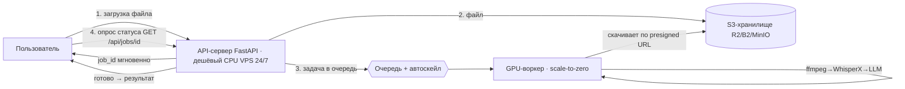

# Transcribe Backend — локальный конвейер с очередью

Замена трёх Gemini-эндпоинтов на self-hosted конвейер:
**ffmpeg → WhisperX (ASR + выравнивание + диаризация по всему файлу) → локальная LLM (саммари)**,
с асинхронной очередью. Экономно сейчас (scale-to-zero), с готовым путём расширения.

Результат отдаётся в той же схеме (`segments[] / summary`), что уже ждёт фронтенд Tranzip AI —
экраны `TranscriptView`, история и экспорт SRT переиспользуются почти без изменений.

## Архитектура



Ключевая идея разделения: **API-сервер лёгкий и работает 24/7 на дешёвом CPU-хосте**
(~$5–10/мес), а дорогой **GPU включается только под реальную нагрузку** и гаснет в простое.

### Где файл «ждёт» и где тратятся деньги
- Загрузка → ответ `job_id`: **мгновенно** (файл только сохраняется и ставится в очередь).
- «Горячий» GPU → обработка стартует за 1–2 сек. «Холодный» (scale-to-zero) → +15–30 сек
  холодного старта — ничтожно на фоне 5–12 мин обработки часа аудио.
- Платите **за секунды реальной работы воркера**, а не за простой GPU.
- Одновременная нагрузка: один воркер = одна задача за раз; остальное ждёт в очереди,
  пока автоскейл не поднимет доп. воркеры (см. «Расширение»).

## Компоненты
| Файл | Что делает |
|---|---|
| `api/main.py` | FastAPI: `POST /api/transcribe`, `GET /api/jobs/{id}`, `/api/health` |
| `api/storage.py` | Загрузка в S3-совместимое хранилище + presigned-ссылки |
| `api/dispatch.py` | Постановка задачи и опрос статуса — ОДИН код для локального воркера и RunPod |
| `worker/pipeline.py` | Ядро: ffmpeg → WhisperX (ASR/align/diarize) → LLM-саммари |
| `worker/handler.py` | Точка входа RunPod Serverless |
| `worker/local_server.py` | Локальный воркер, имитирующий async-API RunPod (для dev без облака) |
| `docker-compose.dev.yml` | Полный локальный стенд: API + Redis + MinIO + GPU-воркер + Ollama |

## Быстрый старт — локально (экономный вариант «на своём GPU»)
Требуется машина с NVIDIA GPU (≥16 ГБ VRAM желательно) и NVIDIA Container Toolkit.

```bash
export HF_TOKEN=hf_xxx                 # https://hf.co/settings/tokens + принять условия pyannote
docker compose -f docker-compose.dev.yml up --build
docker exec -it $(docker ps -qf name=ollama) ollama pull qwen2.5:7b-instruct
```
Проверка:
```bash
curl -F "file=@test.mp4" -F 'options={"language":"auto","enableDiarization":true,"speakerCount":2}' \
     http://localhost:8000/api/transcribe          # -> {"job_id":"...","state":"queued"}
curl http://localhost:8000/api/jobs/<job_id>       # -> state: queued|running|done + результат
```

## Продакшн — воркер на RunPod Serverless (scale-to-zero)
1. Собрать и запушить образ воркера; **закэшировать веса в образ** (см. коммент в `worker/Dockerfile`) —
   это держит холодный старт на 15–30 сек вместо 90.
2. Создать Serverless Endpoint на RunPod (GPU 24 ГБ: RTX 4090 / L40S), задать `HF_TOKEN`,
   `LLM_BASE_URL` (внешняя LLM или второй endpoint), `min workers = 0`, `max workers = 1` на старте.
3. API-сервер (дешёвый VPS) — задать в окружении:
   ```
   DISPATCH_BASE_URL=https://api.runpod.ai/v2/<ENDPOINT_ID>
   DISPATCH_API_KEY=<RUNPOD_API_KEY>
   S3_* (Cloudflare R2 / Backblaze B2), REDIS_URL
   ```
   Переключение «локально ↔ облако» — это смена только этих двух `DISPATCH_*` переменных.

## Путь расширения (заложено в архитектуре)
- **Больше параллелизма:** поднять `max workers` на RunPod — очередь сама распараллелится.
- **Мгновенный отклик в рабочие часы:** `min workers = 1` с 9 до 18, ночью 0.
- **Разделить нагрузку:** вынести LLM-саммари во второй serverless endpoint —
  ASR и суммаризация масштабируются независимо (в `pipeline.summarize` уже отдельный вызов).
- **Меньше опросов:** заменить polling на webhook RunPod → API → push пользователю.
- **Приоритеты/тарифы:** несколько очередей (напр. free/paid) — платные вперёд.
- **Состояние:** Redis → managed Redis/Postgres при росте; S3 уже масштабируется.
Никаких переписываний: те же интерфейсы `dispatch`/`storage`, меняется конфигурация.

## Патч фронтенда (React) — синхронный вызов → очередь
Сейчас `App.tsx` ждёт ответ синхронно. Новый поток: загрузить → получить `job_id` → опрашивать.
Замените тело `handleStartTranscription` на загрузку файла и поллинг:

```ts
// 1) отправляем сам файл (без нарезки в браузере — это делает ffmpeg на сервере)
const form = new FormData();
form.append('file', fileObject);              // File из <input>, не base64
form.append('options', JSON.stringify(payload.options));
const { job_id } = await (await fetch('/api/transcribe', { method: 'POST', body: form })).json();

// 2) опрашиваем статус, пока не done/failed
async function poll(): Promise<any> {
  const job = await (await fetch(`/api/jobs/${job_id}`)).json();
  if (job.state === 'done')   return job.output;         // тот же формат, что раньше
  if (job.state === 'failed') throw new Error(job.error || 'Ошибка обработки');
  setProcessStep(job.state === 'running' ? 'Расшифровка на сервере…' : 'В очереди…');
  await new Promise(r => setTimeout(r, 3000));
  return poll();
}
const recordData = await poll();
```
Файлы `audioExtractor.ts` и вся клиентская нарезка на чанки больше не нужны —
извлечение аудио и разбивку делает сервер (надёжнее и без ограничений браузера по кодекам).

## Заметки
- `HF_TOKEN` обязателен для диаризации: на HuggingFace примите условия моделей
  `pyannote/speaker-diarization-3.1` и `pyannote/segmentation-3.0`.
- `COMPUTE_TYPE=int8` заметно снижает VRAM (можно уложиться в 12 ГБ), почти без потери качества.
- Добавьте авторизацию на `/api/*` (API-ключ/JWT) перед публичным запуском — сейчас эндпоинты открыты.
